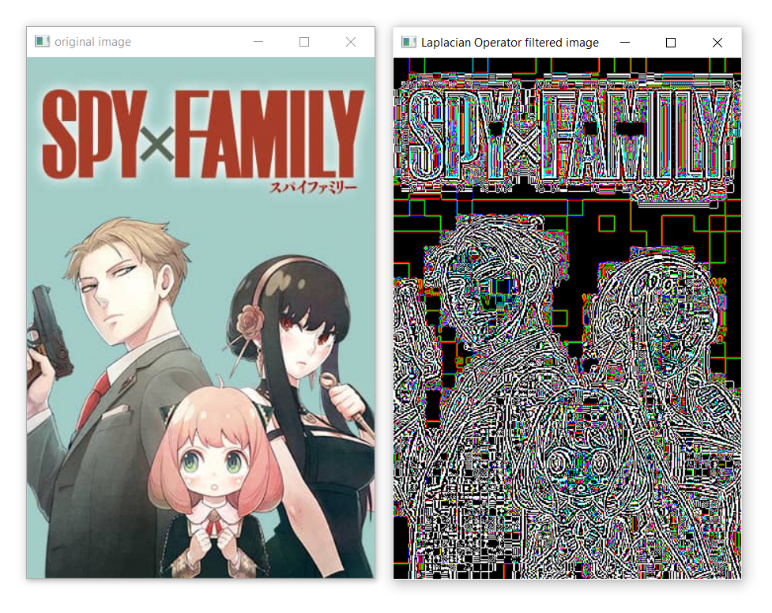

# Implementation-of-Filters
## Aim:
To implement filters for smoothing and sharpening the images in the spatial domain.

## Software Required:
Anaconda - Python 3.7

## Algorithm:
### Step1
Import the necessary modules.
</br>

### Step2
Perform smoothing operation on a image.

- Average filter
- Weighted average filter
- Gaussian Blur
- Median filter
</br>

### Step3
Perform sharpening on a image.

- Laplacian Kernel
- Laplacian Operator
</br> 

### Step4
Display all the images with their respective filters.
</br> 
</br> 
</br> 


## Program:
```python
 Developed By   : Kaushika A
 Register Number: 212221230048
 ```
</br>

## 1. Smoothing Filters
### Using Averaging Filter
```Python
import cv2
import matplotlib.pyplot as plt
import numpy as np

orig=cv2.imread("spyxfamily.jpg")

kernel=np.ones((11,11),np.float32)/121
avg=cv2.filter2D(orig,-1,kernel)
cv2.imshow('original image',orig)
cv2.imshow('averaging filtered image',avg)
cv2.waitKey(0)
cv2.destroyAllWindows()
```
### Using Weighted Averaging Filter
```Python
kernel2=np.array([[1,2,1],[2,4,2],[1,2,1]])/16
w_avg=cv2.filter2D(orig,-1,kernel2)
cv2.imshow('original image',orig)
cv2.imshow('weighted averaging filtered image',w_avg)
cv2.waitKey(0)
cv2.destroyAllWindows()
```
### Using Gaussian Filter
```Python
gauss=cv2.GaussianBlur(orig,(33,33),0,0)
cv2.imshow('original image',orig)
cv2.imshow('gaussian blurred image',gauss)
cv2.waitKey(0)
cv2.destroyAllWindows()
```

### Using Median Filter
```Python
median=cv2.medianBlur(orig,13)
cv2.imshow('original image',orig)
cv2.imshow('median blurred image',median)
cv2.waitKey(0)
cv2.destroyAllWindows()
```

## 2. Sharpening Filters
### Using Laplacian Kernal
```Python
kernel3=np.array([[-1,-1,-1],[2,-2,1],[2,1,-1]])
lap_k=cv2.filter2D(orig,-1,kernel3)
cv2.imshow('original image',orig)
cv2.imshow('Laplacian Kernel filtered image',lap_k)
cv2.waitKey(0)
cv2.destroyAllWindows()
```
### Using Laplacian Operator
```Python
lap_o=cv2.Laplacian(orig,cv2.CV_64F)
cv2.imshow('original image',orig)
cv2.imshow('Laplacian Operator filtered image',lap_o)
cv2.waitKey(0)
cv2.destroyAllWindows()
```

## OUTPUT:
## 1. Smoothing Filters
</br>

### i) Using Averaging Filter

</br>

### ii) Using Weighted Averaging Filter

</br>

### iii) Using Gaussian Filter

</br>

### iv) Using Median Filter

</br>
</br>
</br>
</br>

## 2. Sharpening Filters
</br>

### i) Using Laplacian Kernal

</br>

### ii) Using Laplacian Operator

</br>
</br>
</br>

## Result:
Thus the filters are designed for smoothing and sharpening the images in the spatial domain.
